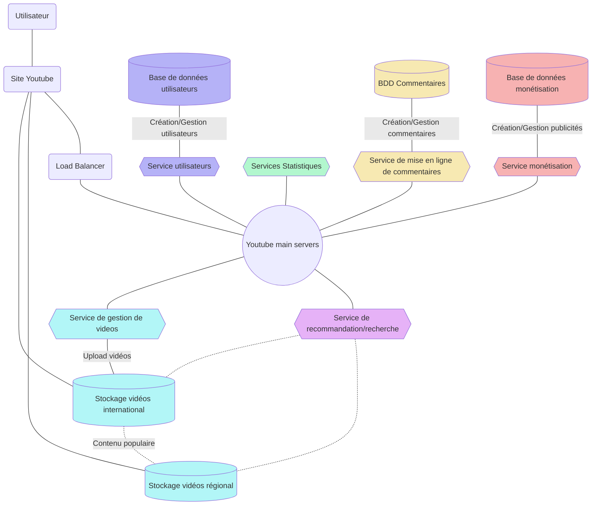

```mermaid
%% Diagramme de l'architecture YouTube
flowchart TB
classDef users fill:#b5b2f7;
classDef stats fill:#b2f7ce;
classDef com fill:#f7e9b2;
classDef money fill:#f7b2b2;
classDef upload fill:#b2f6f7;
classDef recom fill:#e6b2f7;

%% Définition des entités
User(Utilisateur)
Frontend(Site Youtube)
User --- Frontend --- LoadBalancer

%% Le Load Balancer gère la répartition des charges
LoadBalancer(Load Balancer)
LoadBalancer --- Core

Core((Youtube main servers))
CDN[(Stockage vidéos régional)]
Frontend --- CDN
class CDN upload

DB[(Stockage vidéos international)]
Frontend --- DB
class DB upload

%% Le service de recommandation analyse les préférences des utilisateurs pour suggérer du contenu pertinent
Reco{{Service de recommandation/recherche}}
Core --- Reco
Reco -.- CDN
Reco -.- DB
class Reco recom

%% Le service de mise en ligne permet aux utilisateurs de télécharger leurs vidéos
Upload{{Service de gestion de videos}}
Core --- Upload -- Upload vidéos --- DB
class Upload upload

%% Le service utilisateur gère les informations et les activités des utilisateurs
UserService{{Service utilisateurs}}
UserDB[(Base de données utilisateurs)]
UserService --- Core
UserDB -- Création/Gestion utilisateurs --- UserService
class UserService users
class UserDB users

%% Le service de commentaires permet aux utilisateurs de commenter les vidéos
Commentaires{{Service de mise en ligne de commentaires}}
CommentairesDB[(BDD Commentaires)]
Commentaires --- Core
CommentairesDB -- Création/Gestion commentaires --- Commentaires
class Commentaires com
class CommentairesDB com

%% Le service de monétisation gère les publicités et les transactions financières
MoneyService{{Service monétisation}}
MoneyDB[(Base de données monétisation)]
MoneyService --- Core
MoneyDB -- Création/Gestion publicités --- MoneyService
class MoneyService money
class MoneyDB money

%% Le service statistique surveille l'activité sur le site pour fournir des analyses et des rapports
AnalyticsService{{Services Statistiques}}
AnalyticsService --- Core
class AnalyticsService stats

DB -. Contenu populaire .- CDN

```