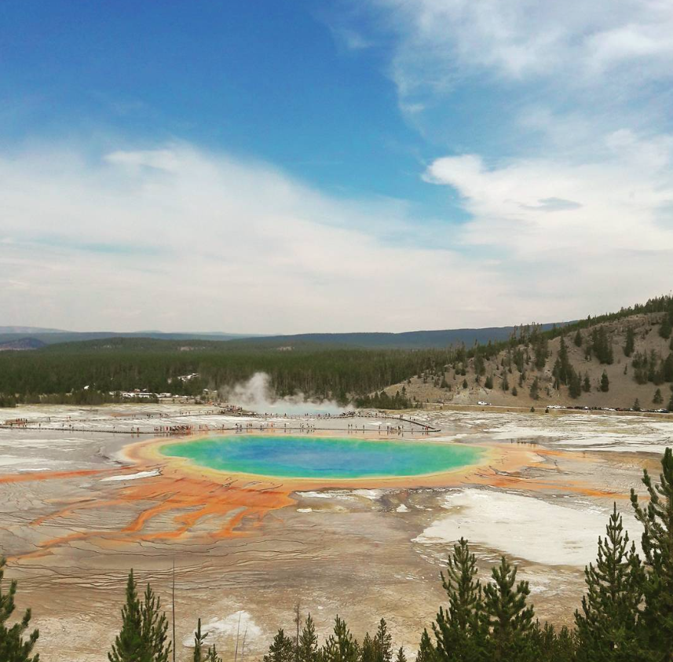

# Why do you need to spend your next holidays in the Yellowstone National Park

## Batiste Laloi

### An Otherworldly Experience

I had always heard about the breathtaking beauty of Yellowstone National Park, the second largest national park in the United States. Spanning across three states - Wyoming, Montana, and Idaho - it's a haven for wildlife and nature enthusiasts. Last summer, I decided to embark on an unforgettable adventure and explore the park firsthand.

### Hiking Through the Wilderness

My journey began with hiking through the pristine wilderness of Yellowstone. With various trails suitable for all skill levels, my friends and I were able to appreciate the stunning landscapes that surrounded us. We marveled at the colorful hot springs and the famous Old Faithful geyser, which erupted right on schedule, providing us with an otherworldly experience.

### Encountering Diverse Wildlife

One of the most exciting aspects of our trip was encountering the diverse wildlife that calls the park home. We spotted bison, elk, and even a few bears from a safe distance. It was truly incredible to witness these majestic creatures in their natural habitat, unafraid of humans thanks to the protected status of the park.

### Camping Under the Stars

After a long day of hiking and exploring, we set up camp in one of Yellowstone's designated campsites. There's something magical about sleeping in a tent under the stars, surrounded by the sounds of nature. We spent our evenings sharing stories and laughter around the campfire, creating memories that will last a lifetime.

### The Adventure of a Lifetime

In conclusion, my visit to Yellowstone National Park was an extraordinary experience I will never forget. The combination of awe-inspiring landscapes, diverse wildlife, and unforgettable outdoor activities left a lasting impression on me. If you're seeking a unique and immersive adventure, I highly recommend planning a trip to this incredible natural wonder.

