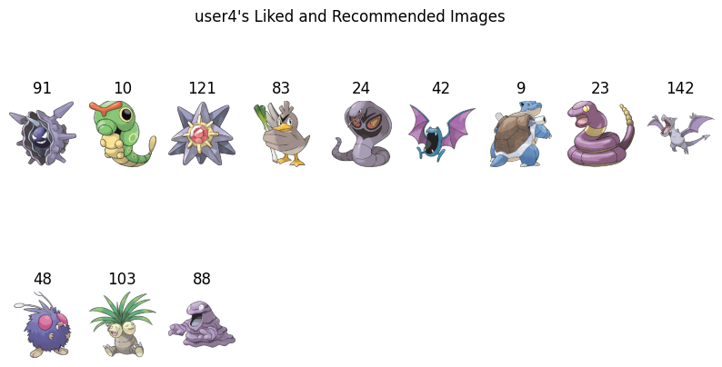

# Data Mining and Machine Learning Project Report

## Authors : Maxime BATTU & Batiste LALOI

### Summary
1. [The goal of our project](#goal)
2. [Data sources of our images and license](#data)
3. [Size of our data](#size)
4. [Information that we decided to store for each image](#info)
5. [Information concerning user preferences](#user)
6. [Recommendation system](#recommendation)
7. [Self-evaluation of our work](#self)
8. [Conclusion](#conclusion)

## The goal of our project <a name="goal"></a>

The goal of this project was to create a recommendation system to give images that are similar to the ones the user liked. We used a array of tools, like the Python programming language with the Notebook technology, and in terms of libraries, we mainly used Pandas, Scikit-learn, Matplotlib, and Numpy. This report is made to explain the different steps we took to achieve our goal, and has been made wusing markdown.

## Data sources of our images and license <a name="data"></a>

We decided to work with Pokémons, and here are the two datasets we used for our project :

1. [Pokemon Images Dataset](https://www.kaggle.com/datasets/kvpratama/pokemon-images-dataset) | License : CC0: Public Domain → We can use it freely for any purpose, even commercial purposes.

2. [Pokemon Image Dataset](https://www.kaggle.com/datasets/vishalsubbiah/pokemon-images-and-types) | License : Attribution 4.0 International (CC BY 4.0) → We can use it freely for any purpose, even commercial purposes, as long as we give credit to the author.

We used the images from the first one because they are way smaller and easier to work with. The second one was only used to get the type of each pokemon, which we used to sync types with each Pokémon.

Every data not used in the dataset is deleted, and we only keep the name of the first 151 Pokémons, their type, and the corresponding thumbmail, all of which is stored in a folder named "data".

## Size of our data <a name="size"></a>

When downloading the two datasets, we got a total of around 75 MB of data, we get lowered to around 8 MB when we delete all the data we do not need (we only keep the low resolution images of the first 151 Pokémons, and we cut the csv file to only keep the type for the Pokémons we have).

During the process, some files will be created, and the total size of the data part of the project is around 8.5 MB.

## Information that we decided to store for each image <a name="info"></a>

As the Pokémon images did not have any metadata, we decided to create some on our own. Here is the information we decided to store for each image :

*  The path of the image
*  The size of the image
*  The format (file extension) of the image
*  The orientation of the image

All of this information is stored in a .json file corresponding to each image.

By clustering the colors in each image, we can also get the most used colors in each image, and store them in a .json file corresponding to each image. That's what we did in the colors.json file, storing all the RGB values of the 2 or 3 most present colors in each image.

By combining the metadata, the colors and the types from the csv file, we end up with a file called data.json, which contains all the information we need for each image.

Here is an example of a the final data stored for the Pokémon **Dragonite** :
```json
// data.json
{
    "148":{
        [...]
    }
    "149": {
        "id": "149",
        "name": "dragonite",
        "type1": "Dragon",
        "type2": "Flying",
        "metadata": {
            "path": "149.png",
            "size": [
                256,
                256
            ],
            "format": "png",
            "orientation": "portrait"
        },
        "colors": [
            "gray",
            "burlywood",
            "tan"
        ]
    },
    "150": {
        [...]
    }
}
```

To extract the color name from the RGB values, we used the **webcolors** Python librarie, allowing us to find color matching patterns in all of our images.

## Information concerning user preferences <a name="user"></a>

We decided to discriminate the Pokémon by their types and the most used colors in their images. We saved the final user preferences in a .json file, called users.json, wich looks like this :
```json
// users.json
{
    "id": 0,
    "name": "user0",
    "images_list": [
        123,
        34,
        [...]
    ],
    "favorite_types": {
        "Poison": 3,
        "Psychic": 2,
        [...]
    },
    "favorite_colors": {
        "dimgray": 5,
        "darkslategray": 4,
        [...]
    },
    "liked_images": [
        [
            11,
            true
        ],
        [
            151,
            true
        ],
        [...]
    ],
    "recommended_images": [
        "3",
        "44",
        "34"
    ]
}
```

Each user is first assigned a random list of 10 Pokémons to see. Then, random likes or dislikes are assigned to each images, from which we can get the favorite types and colors of the user, by mesuring the number of occurence of each type and color in the liked images.

<br>

## Recommendation system <a name="recommendation"></a>

We implemented a content-based recommendation system in this project, focusing on recommending Pokémon images based on the content of the images rather than user behavior. The system takes into account the metadata, colors, and types of each image to make recommendations tailored to the user's preferences.

Using a clustering approach with the MiniBatchKMeans algorithm, the system first preprocesses the data by extracting features from the Pokémon images and grouping them into clusters. It then determines the user's favorite types and colors based on the images they liked and identifies the cluster that best matches their preferences.

This content-based recommendation system suggests new Pokémon images to the user by selecting images from the closest matching cluster that the user hasn't liked yet. The recommendations are made by comparing the similarity of the images' features, specifically their metadata, colors, and types, to the user's preferences.

Here is an example of the recommended Pokémon images (the three on the bottom line) to a user that mainly liked of purple-ish Pokémons and Poison-type Pokémons :



## Self-evaluation of our work <a name="self"></a>

We are satisfied with the result of our project, as we managed to create a recommendation system that works well. We are also satisfied with the way we worked together. However, our model is does not take into account the shape or the cuteness of the Pokémons, which are two big factors when it comes to choosing a Pokémon. As our first AI/ML project, we are proud of what we achieved, an it was a satysfing to see all the different steps of a machine learning project.

<br>
<br>
<br>


## Conclusion <a name="conclusion"></a>

We are proud of what we achieved, and we are satisfied with the result of our project. We learned a lot about the different steps of a machine learning project, and we are now able to create a recommendation system from scratch. We also learned a lot about the different Python libraries we used, and we hope to be able to use them in future projects.