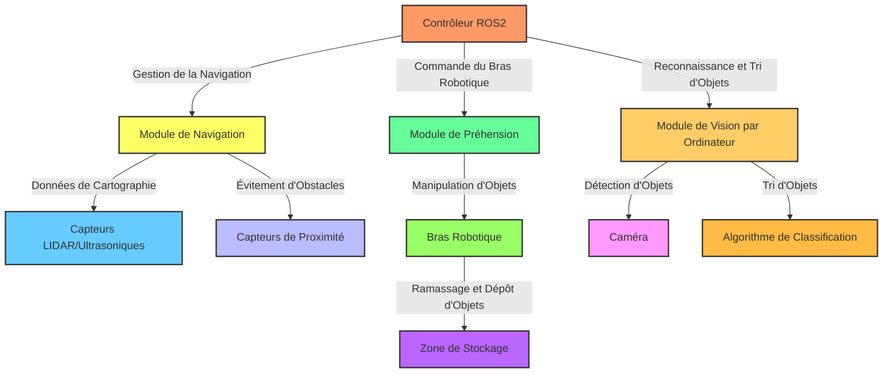

# Projet : TurtleBot Rangeur d'Espace avec Commandes Vocales

## Objectif Global
Développer un système logiciel pour un TurtleBot qui navigue dans un espace, identifie, trie, et range des objets dispersés (balles, objets en plastique, etc.) dans une zone de stockage définie, avec la possibilité de recevoir des instructions vocales.

### 1. Navigation et Cartographie
- **Cartographie de l'Espace** : Création d'une carte de la zone à ranger avec des capteurs.
- **Navigation Autonome** : Algorithme pour le déplacement autonome du TurtleBot.

### 2. Détection et Tri d'Objets
- **Reconnaissance d'Objets** : Identification des objets au sol via vision par ordinateur.
- **Classification des Objets** : Catégorisation automatique des objets détectés.
- **Système de Tri** : Mécanisme pour le tri et la séparation des objets.

### 3. Rangement des Objets
- **Manipulation d'Objets** : Utilisation d'un bras robotique pour la collecte et le transport.
- **Dépôt dans Zone de Stockage** : Placement des objets dans une zone prédéfinie.

### 4. Commandes Vocales (Speech to Text)
- **Intégration STT** : Système de reconnaissance vocale pour recevoir des instructions spécifiques.
- **Traitement des Instructions Vocales** : Interprétation et exécution des commandes vocales.
- **Feedback Vocal** : Réponses vocales pour confirmer les actions ou demandes.

### 5. Interface Utilisateur
- **Contrôle et Suivi** : Interface pour le démarrage, l'arrêt, et le suivi du robot.
- **Feedback Visuel** : Retransmission vidéo en direct pour surveillance.

### 6. Sécurité et Fiabilité
- **Gestion des Erreurs et Obstacles** : Système de réponse aux imprévus.
- **Tests de Sécurité** : Vérifications pour la sûreté du robot.

### 7. Documentation Technique
- **Guide d'Utilisation** : Instructions pour l'opération et la maintenance.
- **Rapport de Projet** : Analyse des méthodes, algorithmes, et résultats obtenus.

## Objectif prioritaire

Le robot doit pouvoir se mouvoir de manière autonome dans un espace, pour prendre des objets et les déplacer dans un espace de stockage. Tout ça codé en ROS2.

Fonctionnalités a assurer en priorité :
- Déplacement autonome
- Déplacement du bras
- Detection, Ramassage, dépôt et tri d'items au sol

