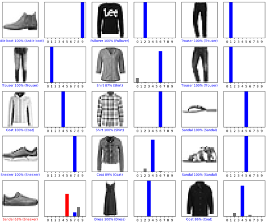
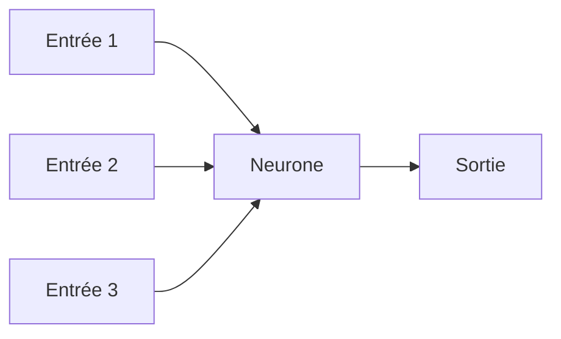

<!--  -->
# Vision appliquée pour la Robotique
## Majeure ROBIA - Module IA Vision - 2023/2024

### TP1 - Classification d'images par Deeplearning - Prise en main de Tensorflow

#### Partie 1

##### Question 1

> 1.1 Expliquez les points communs et différences entre Keras, Tensorflow, pytorch et Yolo Darknet

Tableau de comparaison :

| Particularité | Keras | Tensorflow | Pytorch | Yolo Darknet |
| :---: | :---: | :---: | :---: | :---: |
| **Langage** | Python | Python, C++, Java, Go, Rust, JavaScript | Python, C++, Java, Go, Rust, JavaScript | C |
| **Date de sortie** | 2015 | 2015 | 2016 | 2016 |
| **Prise en main** | Facile | Moyen | Moyen | Difficile |
| **Utilisation** | Débutant | Avancé | Avancé | Avancé |
| **Avantages** | Facile à utiliser, rapide à mettre en place | Rapide, multiplateforme, multi-langage | Rapide, multiplateforme, multi-langage | Rapide, multiplateforme, multi-langage |
| **Inconvénients** | Peu de fonctionnalités, peu de possibilités de personnalisation | Difficile à prendre en main, peu de fonctionnalités, peu de possibilités de personnalisation | Difficile à prendre en main, peu de fonctionnalités, peu de possibilités de personnalisation | Difficile à prendre en main, peu de fonctionnalités, peu de possibilités de personnalisation |

> 1.2 On explicitera en particulier, ce qui est « statique » vs « dynamique » dans chacun de ces outils.

- **Keras** : Keras est une API de réseaux de neurones de haut niveau, écrite en Python et capable de fonctionner au-dessus de TensorFlow, CNTK ou Theano. Il a été développé dans le but de permettre une expérimentation rapide. Être capable de passer rapidement de l'idée à l'expérimentation est essentiel dans la recherche et le développement. Keras suit les meilleures pratiques en matière de réseaux de neurones : il permet une configuration facile, une modularité et une extensibilité maximales.

- **Tensorflow** : TensorFlow est une bibliothèque logicielle open source de bout en bout pour l'apprentissage automatique. Il prend en charge le développement et le déploiement de modèles d'apprentissage automatique dans un large éventail de domaines d'application. TensorFlow fournit une API de niveau supérieur, Keras, qui simplifie la construction, la formation et le déploiement de modèles d'apprentissage automatique.

- **Pytorch** : PyTorch est une bibliothèque logicielle open source pour les calculs scientifiques utilisant des tenseurs. Il est également utilisé pour les applications telles que la vision par ordinateur et l'apprentissage profond. Il est basé sur Torch, une bibliothèque d'apprentissage automatique qui est implémentée en Lua et qui utilise une interface C/CUDA. PyTorch fournit deux niveaux de fonctionnalités : Numpy et les tenseurs. Les tenseurs sont similaires aux tableaux Numpy, mais peuvent également être utilisés sur un GPU pour accélérer les calculs.

- **Yolo Darknet** : YOLO (You Only Look Once) est un algorithme d'apprentissage profond pour la détection d'objets qui détecte une grande variété d'objets dans des images. YOLO est un réseau neuronal convolutif (CNN) qui effectue la détection d'objets en un seul passage de l'image à travers le réseau. Cela conduit à une détection extrêmement rapide, à des taux d'erreur plus élevés et à une meilleure généralisation.

> Comment est décrit le réseau de neurones dans chacun de ces outils ? (Donner des exemples)

- Pour Tensorflow :

```python
model = tf.keras.models.Sequential([ # Sequential model
    tf.keras.layers.Flatten(input_shape=(28, 28)), # Flatten layer
    tf.keras.layers.Dense(128, activation='relu'), # Dense layer
    tf.keras.layers.Dropout(0.2), # Dropout layer
    tf.keras.layers.Dense(10) # Dense layer
])
```

- Pour Pytorch :

```python
class Net(nn.Module): # Net class
    def __init__(self): # Constructor
        super(Net, self).__init__() # Super constructor
        self.conv1 = nn.Conv2d(1, 32, 3, 1) # Conv2d layer
        self.conv2 = nn.Conv2d(32, 64, 3, 1) # Conv2d layer
        self.dropout1 = nn.Dropout2d(0.25) # Dropout2d layer
        self.dropout2 = nn.Dropout2d(0.5) # Dropout2d layer
        self.fc1 = nn.Linear(9216, 128) # Linear layer
        self.fc2 = nn.Linear(128, 10) # Linear layer
```

##### Question 2

> 2.1 Donner la définition informatique d'un neurone dans un réseau de neurones

Un neurone est une unité de traitement de l'information dans un réseau de neurones artificiels. Il est composé d'un ensemble d'entrées, d'un ensemble de poids, d'une fonction d'activation et d'une sortie.



